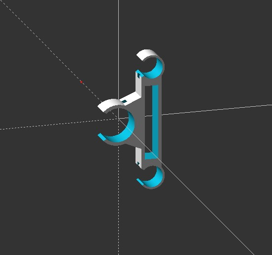
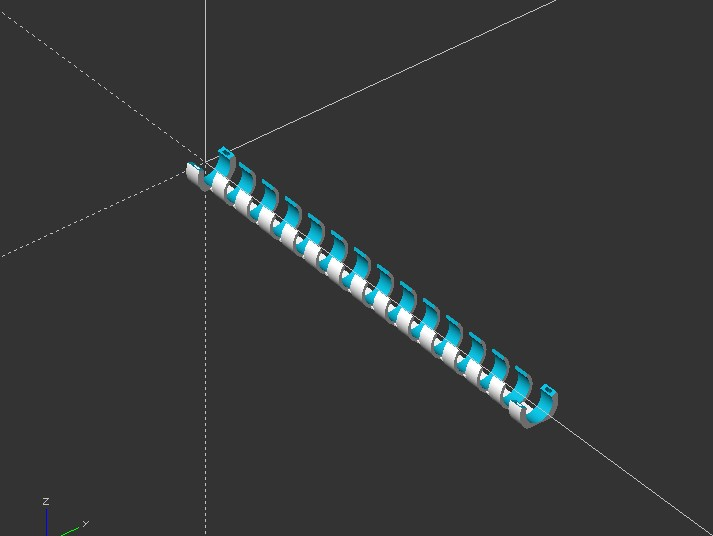

# 3dprint-weehoo-trailers-hacks
 

## Hacks for Weehoo trailers

### Thrill

A small piece to keep the chain tubes for moving. Can be tigthen with cable ties.

### Thrill - Two

Designed to protect the bottom tube of the trailer to be scratched or damaged. Can be tigthen with cable ties.

Made with OpenSCAD.

## Hacks pour les remorques de vélo Weehoo

### Thrill

Une petite pièce conçue pour empêcher les tubes de la chaîne de bouger. Peut être maintenu avec des colliers de serrage.

### Thrill - Two

Conçu pour protéger le tube du bas de la remorque des rayures et des choc. Peut être maintenu avec des colliers de serrage.

Réalisé avec OpenSCAD.

## Captures

### Thrill

### Thrill - Two

